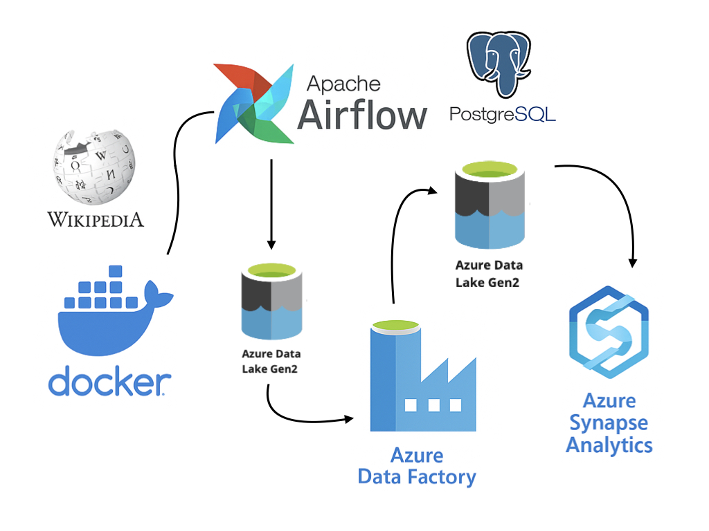

本專案使用爬蟲爬取維基百科頁面[List of association football stadiums by capacity](https://en.wikipedia.org/wiki/List_of_association_football_stadiums_by_capacity)足球場資訊
，使用 Apache Airflow 部署於 Docker 容器中。

🔁 資料流程概觀（ETL）

Extract：從 Wikipedia 擷取原始 HTML 表格，對應`get_wikipedia_page(url)`、`get_wikipedia_data(html)`

Transform：資料清理、結構化、地理定位轉換，對應`clean_text(text)`

Load：寫成結構化格式（如 CSV），供後續分析或儲存，對應`write_wikipedia_data(**kwargs`  

使用**Azure Data Lake Storage Gen2**，來儲存從 Wikipedia 擷取來的原始資料和清洗後資料，**Azure Data Factory (ADF)** 把儲存在 ADLS 的資料複製、轉換並傳送至下游
，將處理完的資料儲存在下一個**Azure Data Lake Storage Gen2**，作為後續在 **Azure Synapse Analytics** 的資料分析。 在Synapse Analytics 中 ， 使用Serverless SQL Pool，
查詢 Data Lake 裡的資料，並簡單製作分析圖表。
